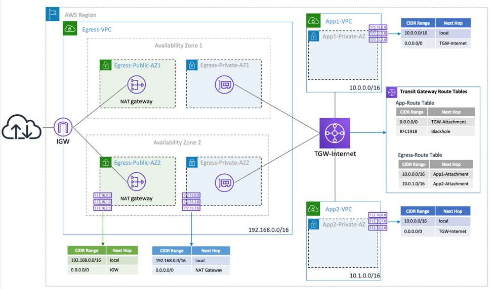

## Blog: How to use Transit Gateway to create a single exit point to the internet from multiple VPCs

### Introduction

The cloudformation in this project are intended to be used in support of the AWS blog article here: https://aws.amazon.com/blogs/networking-and-content-delivery/creating-a-single-internet-exit-point-from-multiple-vpcs-using-aws-transit-gateway/

The files contained here are as follows:

|File                                    | Description                                                                 |
|----------------------------------------|-----------------------------------------------------------------------------|
|`transitgateway-egress-solution-v2.yaml`|The cloudformation template to create the solution in the blog               |

The cloudformation automatically creates the solution highlighted in the blog, and will populate the VPC route tables with the correct routes after creation of the transit gateway attachments. This function has recently been added to cloudformation.

The purpose of the cloudformation is to create this architecture...

### Running the cloudformation template

You can either upload the cloudformation template to an S3 bucket in the same region as you want to deploy it, or upload it as part of running the cloudformation from the console.

This should then create the entire environment, update the VPC route tables and be ready for you to play with.

### How I tested the deployed environment

For testing, I just created a linux instance in each of the app subnets, and also one in the public egress subnet. This public one, i gave a public as well as private IP address, so i could ssh in. I then created the appropriate security groups so that ssh and ICMP were permitted, and proved that i could ping and ssh between all the instances.

## License

This library is licensed under the MIT-0 License. See the LICENSE file.
